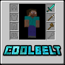

# Coolbelt

Coolbelt is a toolbelt mod for Minecraft Beta 1.7.3 that adds slots for your **sword**, **pickaxe**, **axe**, and **shovel**. 
The tool that is currently in-use is displayed in your main hand and replaces the item currently being held.
The mod automatically selects the most efficient tool for the job, unless the currently held item would be equally efficient or better.

## Dependencies

This mod requires the following in order to function:

- **Babric**
- **Station API**
- **Accessory API**

## Installation

1. Ensure **Babric**, **Station API**, and **Accessory API** are installed for Minecraft Beta 1.7.3.
2. Download the `coolbelt-x.x.x.jar` file.
3. Place the `.jar` file into your instance's `mods` directory.
4. Launch the instance.

## Compatibility

Because Coolbelt heavily utilizes mixins into the `PlayerInventory` class, it may conflict with mods that do the same or overwrite it.
